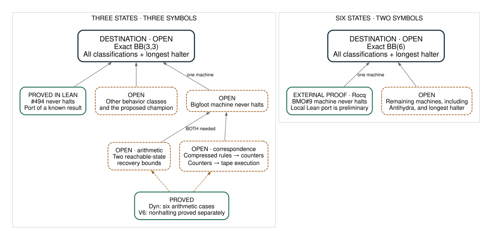

# Busy Beaver: where the proof stands

**Project map · 26 September 2026**  
[Visual edition](OVERVIEW.html) · [Detailed research review](notes/31-research-trajectory-2026-09-25.md)

## The destination

**Determine exactly how long the longest halting machine of a fixed size can run.**  That means classifying every relevant machine and certifying the longest halter.  This repo studies selected difficult machines in two separate problems:

- **BB(3,3):** three states, three tape symbols.  Bigfoot belongs here.
- **BB(6):** six states, two tape symbols.  Antihydra and BMO#9 belong here.

**Neither exact value is proved here.**  A proof for one cryptid would remove a concrete obstruction, but it would not settle its entire Busy Beaver problem.

## The map

**Reading the map:** solid arrows feed a larger proof obligation; dashed arrows mark intended, unproved links.  All incoming requirements must be met together; classifying one machine is not sufficient.  “External” identifies a proof in another project's proof assistant.

## What we have actually established

| Result | What it tells us | Its boundary |
|---|---|---|
| **Machine #494 never halts** | A complete Lean port of a known BB(3,3) result, including the actual Turing-machine statement. | It independently formalizes a settled machine. |
| **Bigfoot has six residue-dependent arithmetic cases** | The counter dynamics and the only arithmetic halt condition are explicit. | Describing the rules does not prove the orbit avoids halting. |
| **A derived Bigfoot rule system never halts** | One simplified system has the required behavior. | Its relationship to the actual orbit and Turing machine is unfinished. |
| **BMO#3 and #4 formalized; #9 scaffold built** | The #9 model isolates the fatal prefix and its only live predecessor. | These local #9 lemmas do not prove nonhalting. |

“Collatz-like” means these machines produce integer recurrences with residue-dependent rules.  No theorem here transfers a solution of ordinary Collatz to these machines, or vice versa.

## Where we are pressing

### Bigfoot: two different gaps must close

**The arithmetic gap is recovery.**  In compressed coordinates, a counter can be spent through a cascade of transitions.  We need an invariant showing that it recovers before it can fall too low.  The current reduction isolates two precise bounds: whenever the reachable pattern and counter are `(P1,9)` or `(P1,3)`, the reserve `k` must be at least 2.  Both remain open; the second is the harder cascade.

**The correspondence gap connects that arithmetic to the real machine.**  We still need the bridge between the compressed V6 rules and the original counter dynamics, and a proof that the counter macrosteps faithfully simulate tape execution.  A theorem proves that the completed simulation plus arithmetic nonhalting would imply machine nonhalting.  Its simulation input is not yet proved.

These are concrete mathematical and formalization targets.  The inspected September commits contain no new proof of the recovery cascade; this is a remaining frontier, not evidence of an advancing current campaign.

### BMO#9: the recent activity now has a known destination

The local September 25 work added the rewrite model and finite probes.  A subsequent source check identified a **September 24 Rocq proof of the machine's nonhalting** in busycoq.  Its proof uses singleton returns, finite tables, and a global induction controlling the return budget.  The source has been inspected; its complete dependency build was not repeated here.

A Lean port is therefore an available **known-theorem formalization project**, with an external proof to follow and a machine-level endpoint.  It is substantial work, beyond the preliminary local lemmas.  It would again provide an externally established theorem to follow through to a complete formal proof.

### A proposed new research direction: prove a method cannot succeed

“Genuine irregularity” would prove that **no regular closed tape-language certificate** can certify a particular machine's nonhalting.  That could explain a whole class of decider failures.  It is a recommendation from the review, with no local implementation or established reduction yet.  It should not be mistaken for active progress.

## What would count as a change in position?

| Next result | What changes |
|---|---|
| Close Bigfoot's recovery bounds and both correspondence gaps | A complete nonhalting proof for an individual hard machine. |
| Port the BMO#9 proof through to the actual TM theorem | A substantial finished formalization with an independently known answer. |
| Prove universal irregularity for a named machine | A structural result explaining a limit of regular-language methods. |
| Classify all remaining machines and certify the longest halter | An exact Busy Beaver value for the corresponding machine size. |

Other BB(3,3) behavior classes and the proposed champion still require proofs.  Antihydra remains a separate BB(6) obstruction.  Finite simulations and old unsuccessful parameter sweeps are useful evidence about methods, not proofs that an orbit remains safe forever.

## Evidence and upkeep

Snapshot: `init` at `6ec0fe0`.  Read [Bigfoot's arithmetic rules](lean/Collatz/Bigfoot/Classification.lean), [recovery bounds](lean/Collatz/Bigfoot/V6KPos.lean), [machine reduction](lean/Collatz/Bigfoot/Reduction.lean), [#494's completed proof](lean/Collatz/BB33_494.lean), and [the BMO#9 source correction and proof outline](notes/30-bmo9-first-pass-2026-09-25.md).  The root README's older species roadmap is historical.

This is the maintained reader's map.  Update it when a machine or a proof obligation changes status; retain detailed discoveries in `notes/`.  Diagram source: [docs/overview.dot](docs/overview.dot).  Rebuild the visual edition with `make -f docs/overview.mk`.
